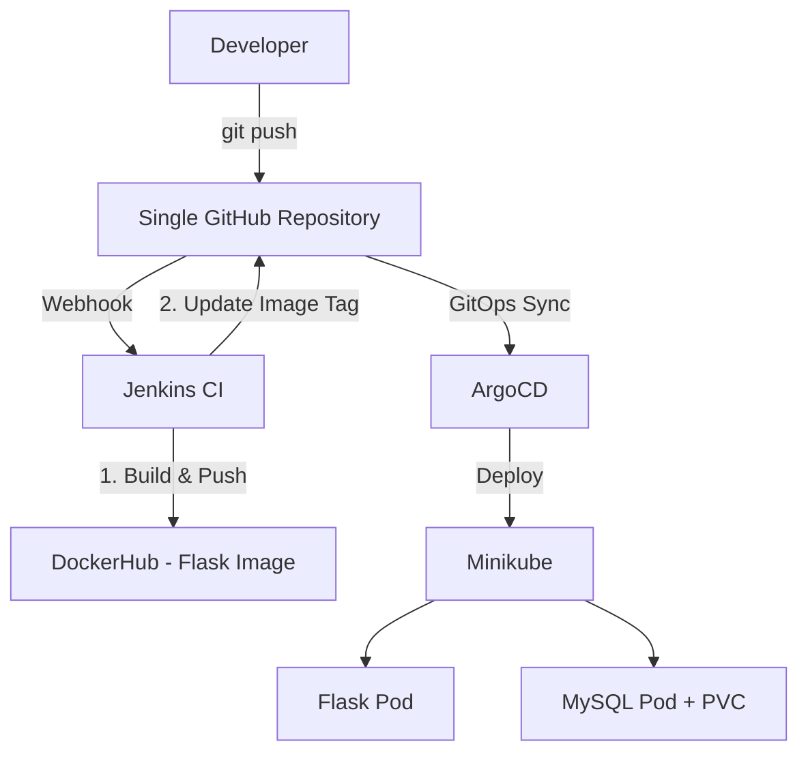

### **Deploying Flask Application with MySQL using GitHub, Jenkins & ArgoCD (Single Repo)**

In this guide, we will deploy a **Flask Python web application** with **MySQL** database on Kubernetes using **one GitHub repository** and **one Jenkins job**.

This is a simplified version ideal for learning and small projects.

### **Architecture Diagram**

### **Workflow**

1. Developer pushes code to `main` branch.
2. GitHub Webhook triggers **single Jenkins job**.
3. Jenkins builds the Flask Docker image and pushes it to DockerHub.
4. Jenkins updates the image tag in the Kubernetes manifest (same repo).
5. Jenkins commits and pushes the change.
6. ArgoCD detects the change and syncs the application (Flask + MySQL) to Kubernetes.

---

---

### **Jenkins Setup (Single Job)**

#### **Recommended Plugins**
- **Docker Pipeline**
- **Docker**
- **Git**
- **GitHub Integration**
- **Pipeline: GitHub Webhook**
- **Pipeline**
- **Credentials Binding**

---

### **Single Jenkins Job Configuration**

**Job Name**: `flask-mysql-deploy` (or any name you like)

- **Type**: Pipeline
- **Pipeline script from SCM**
- **Repository URL**: Your single GitHub repo
- **Branch**: `main`
- **Enable**: "GitHub hook trigger for GITScm polling"

---

### **Jenkinsfile (Single Job)**

---

### **GitHub Webhook Setup**

1. Go to your repository → **Settings → Webhooks → Add webhook**
2. **Payload URL**: `http://YOUR_JENKINS_IP:8080/github-webhook/`
3. **Content type**: `application/json`
4. Select **Just the push event**
5. Add webhook

---

