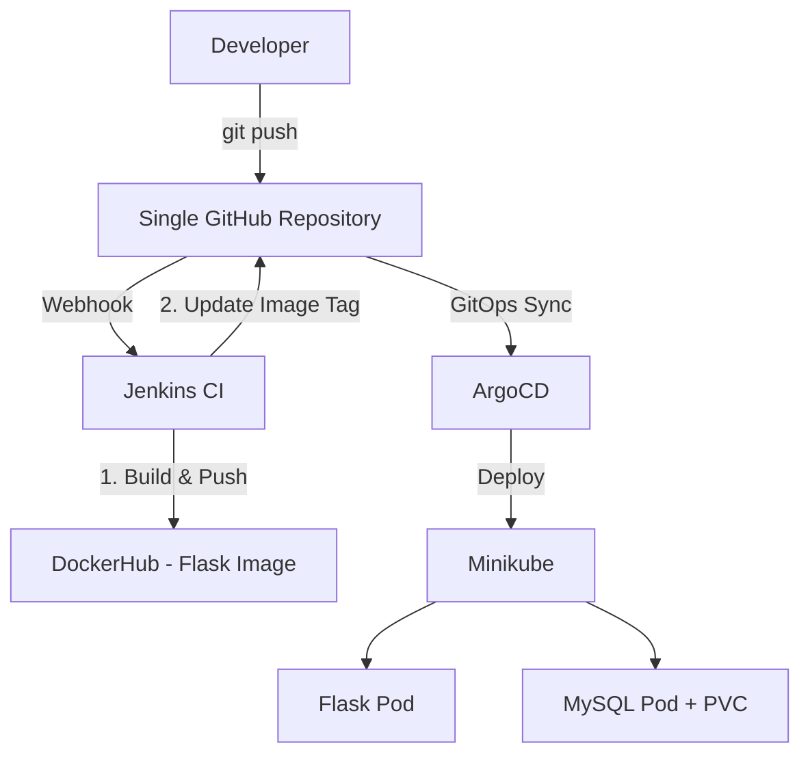

**✅ Updated Article – Single Repository & Single Jenkins Job**

Here's the revised version tailored to your new requirement:

---

### **Deploying Flask Application with MySQL using GitHub, Jenkins & ArgoCD (Single Repo)**

In this guide, we will deploy a **Flask Python web application** with **MySQL** database on Kubernetes using **one GitHub repository** and **one Jenkins job**.

This is a simplified version ideal for learning and small projects.

### **Architecture Diagram**



### **Workflow**

1. Developer pushes code to `main` branch.
2. GitHub Webhook triggers **single Jenkins job**.
3. Jenkins builds the Flask Docker image and pushes it to DockerHub.
4. Jenkins updates the image tag in the Kubernetes manifest (same repo).
5. Jenkins commits and pushes the change.
6. ArgoCD detects the change and syncs the application (Flask + MySQL) to Kubernetes.

---

### **GitHub Repository Structure (Single Repo)**

Recommended folder structure:

```
flask-mysql-app/
├── app.py
├── requirements.txt
├── Dockerfile
├── Jenkinsfile
├── k8s/
│   ├── flask-deployment.yaml
│   ├── flask-service.yaml
│   ├── mysql-deployment.yaml
│   ├── mysql-service.yaml
│   ├── mysql-pv.yaml
│   ├── mysql-pvc.yaml
│   └── mysql-secret.yaml
```

---

### **Jenkins Setup (Single Job)**

#### **Recommended Plugins**
- **Docker Pipeline**
- **Docker**
- **Git**
- **GitHub Integration**
- **Pipeline: GitHub Webhook**
- **Pipeline**
- **Credentials Binding**

---

### **Single Jenkins Job Configuration**

**Job Name**: `flask-mysql-deploy` (or any name you like)

- **Type**: Pipeline
- **Pipeline script from SCM**
- **Repository URL**: Your single GitHub repo
- **Branch**: `main`
- **Enable**: "GitHub hook trigger for GITScm polling"

---

### **Jenkinsfile (Single Job)**

```groovy
pipeline {
    agent any
    
    environment {
        DOCKERHUB_CREDENTIALS = 'dockerhub-cred'   // Your credential ID
        IMAGE_NAME = 'yourusername/flask-mysql-app' // Change this
        GIT_REPO = 'https://github.com/yourusername/flask-mysql-app.git'
    }
    
    stages {
        stage('Checkout Code') {
            steps {
                checkout scm
            }
        }
        
        stage('Build & Push Docker Image') {
            steps {
                script {
                    docker.withRegistry('', DOCKERHUB_CREDENTIALS) {
                        def customImage = docker.build("${IMAGE_NAME}:${env.BUILD_NUMBER}")
                        customImage.push()
                        customImage.push('latest')
                    }
                }
            }
        }
        
        stage('Update Kubernetes Manifest') {
            steps {
                script {
                    sh """
                        sed -i "s|image: ${IMAGE_NAME}:.*|image: ${IMAGE_NAME}:${env.BUILD_NUMBER}|g" k8s/flask-deployment.yaml
                        
                        git config user.name "Jenkins CI"
                        git config user.email "jenkins@ci.com"
                        git add k8s/flask-deployment.yaml
                        git commit -m "Update Flask image to ${env.BUILD_NUMBER}" || echo "No changes to commit"
                        git push origin main
                    """
                }
            }
        }
    }
    
    post {
        success {
            echo "✅ Deployment pipeline completed successfully!"
        }
        failure {
            echo "❌ Pipeline failed!"
        }
    }
}
```

---

### **GitHub Webhook Setup**

1. Go to your repository → **Settings → Webhooks → Add webhook**
2. **Payload URL**: `http://YOUR_JENKINS_IP:8080/github-webhook/`
3. **Content type**: `application/json`
4. Select **Just the push event**
5. Add webhook

---

### **ArgoCD Configuration**

Create an ArgoCD Application that points to the `k8s/` folder in your single repository.

**Example ArgoCD Application YAML** (`k8s/argocd-app.yaml`):

```yaml
apiVersion: argoproj.io/v1alpha1
kind: Application
metadata:
  name: flask-mysql-app
  namespace: argocd
spec:
  project: default
  source:
    repoURL: https://github.com/yourusername/flask-mysql-app.git
    targetRevision: main
    path: k8s
  destination:
    server: https://kubernetes.default.svc
    namespace: flask-app
  syncPolicy:
    automated:
      prune: true
      selfHeal: true
```

---

### **Next Steps for You**

Please share the following so I can make this article even more complete:

1. Your GitHub repository link
2. Your `Dockerfile`
3. Your `app.py` (especially the MySQL connection part)
4. Namespace you want to use (e.g., `flask-app`)

Would you like me to also provide:
- Sample Flask + MySQL code?
- Complete Kubernetes manifests (with PV, PVC, Secret)?
- Best practices for handling DB passwords?

Just tell me and I’ll expand this article with full working examples.
